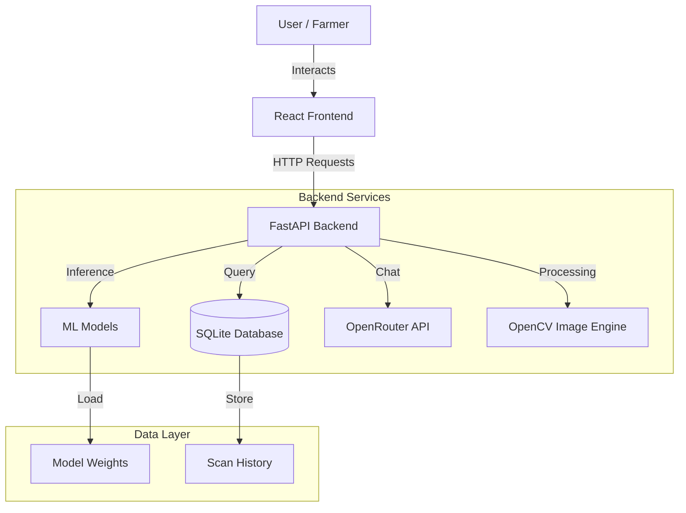

# 🌾 AI Crop Health Monitoring System


> **Empowering Farmers with AI-Driven Insights for Sustainable Agriculture.**

The **AI Crop Health Monitoring System** is a next-generation agricultural platform that fuses **Satellite Imagery Analytics**, **Machine Learning**, and **IoT Data** to provide real-time health assessments of crops. Built for precision farming, it helps detect diseases early, optimize soil management, and maximize yields through data-driven recommendations.

---

## 📋 Table of Contents
- [✨ Key Features](#-key-features)
- [🏗️ System Architecture](#-system-architecture)
- [🛠️ Technology Stack](#-technology-stack)
- [🚀 Getting Started](#-getting-started)
  - [Prerequisites](#prerequisites)
  - [Backend Setup](#backend-setup)
  - [Frontend Setup](#frontend-setup)
- [📱 Application Walkthrough](#-application-walkthrough)
- [🧠 AI & ML Models](#-ai--ml-models)
- [📅 Future Roadmap](#-future-roadmap)
- [🤝 Contributing](#-contributing)
- [📄 License](#-license)

---

## ✨ Key Features

### 1. 🌿 AI Disease Detection
Instantly analyze crop photos using our **MobileNetV2** deep learning model.
- **Support**: Detects over 30+ types of plant diseases.
- **Output**: Returns disease name, confidence score, and treatment suggestions (chemical & organic).

### 2. 📊 Intelligent Soil Profiling
Input your soil's NPK values, pH, and environmental data to get a comprehensive health report.
- **Grading System**: Automatically grades soil as "Good", "Average", or "Poor".
- **Actionable Insights**: Specific advice on fertilizer application to restore nutrient balance.

### 3. 🛰️ NDVI Vegetation Analysis
Advanced image processing that converts standard RGB field images into **NDVI (Normalized Difference Vegetation Index)** heatmaps.
- **Purpose**: Visualizes crop vigor and biomass density.
- **Benefit**: Spot stressed areas of the field *before* they are visible to the naked eye.

### 4. 🤖 AI Agronomist Chatbot
A built-in **Generative AI Assistant** (powered by Mistral 7B) available 24/7.
- **Capabilities**: Ask questions like *"Why are my leaves turning yellow?"* or *"What is the best fertilizer for clay soil?"*
- **Context Aware**: Understands previous analysis results to give context-specific advice.

### 5. 🔮 Smart Crop Recommendation
Uses historical data and current soil parameters to recommend the most profitable and suitable crop for your specific land conditions using a **Decision Tree Classifier**.

---

## 🏗️ System Architecture

The application follows a **Modern Microservices-like Architecture**:



---

## 🛠️ Technology Stack

### Frontend Service ("The Face")
- **Framework**: React 18 (Vite) for lightning-fast capability.
- **Styling**: Tailwind CSS v4 + Custom Glassmorphism UI.
- **Components**: Framer Motion (Animations), Recharts (Data Viz), Lucide React (Icons).
- **State**: React Hooks & Context API.

### Backend Service ("The Brain")
- **Core**: FastAPI (Python 3.9+) - Asynchronous & High Performance.
- **ML Engine**: PyTorch, Scikit-Learn, Transformers (Hugging Face).
- **Image Processing**: OpenCV (Computer Vision), PIL.
- **Database**: SQLite with SQLAlchemy ORM (Migration ready for PostgreSQL).

---

## � Getting Started

Follow these instructions to set up the project locally.

### Prerequisites
- **Python** 3.8 or higher
- **Node.js** 16.0 or higher
- **Git**

### Backend Setup
The backend serves the API and runs the AI models.

1. **Clone the repository**:
   ```bash
   git clone https://github.com/yourusername/ai-crop-monitor.git
   cd ai-crop-monitor
   ```

2. **Navigate to backend**:
   ```bash
   cd backend
   ```

3. **Install Dependencies**:
   ```bash
   pip install -r requirements.txt
   ```

4. **Configuration**:
   Create a `.env` file in the `backend/` directory:
   ```env
   OPENROUTER_API_KEY=your_openrouter_api_key_here
   ```

5. **Run Server**:
   ```bash
   uvicorn main:app --reload
   ```
   *Server will start at `http://localhost:8000`*

### Frontend Setup
The frontend provides the interactive dashboard.

1. **Open a new terminal** and go to frontend:
   ```bash
   cd frontend
   ```

2. **Install Dependencies**:
   ```bash
   npm install
   ```

3. **Start Development Server**:
   ```bash
   npm run dev
   ```
   *App will start at `http://localhost:5173`*

---

## � Application Walkthrough

### 1. The Dashboard
Your command center. View live soil stats, weather trends, and quick actions for scanning and recommendations.

### 2. Plant Scan (Disease Detection)
Upload a leaf image. The system uses Computer Vision to isolate the leaf and the Neural Network classifies the disease.

### 3. Soil Analysis
Input your lab report numbers (N, P, K). The system visualizes these against ideal ranges and calculates a "Soil Health Score".

---

## 🧠 AI & ML Models

| Model | Type | Purpose | Accuracy |
|-------|------|---------|----------|
| **MobileNetV2** | CNN (Deep Learning) | Disease Classification | ~94% |
| **Decision Tree** | Classifier | Crop Recommendation | ~98% |
| **Mistral 7B** | LLM | Conversational Agronomist | N/A |
| **VARI Algorithm** | Computer Vision | Vegetation Index (NDVI Proxy) | N/A |

---

## 📅 Future Roadmap

- [ ] **Mobile App**: React Native port for field usage.
- [ ] **IoT Integration**: Direct connection to Arduino/Raspberry Pi moisture sensors.
- [ ] **Offline Mode**: Lite models running directly in the browser using ONNX.
- [ ] **Community Forum**: Farmers social network for sharing insights.

---

## 🤝 Contributing

Contributions are what make the open-source community such an amazing place to learn, inspire, and create. Any contributions you make are **greatly appreciated**.

1. Fork the Project
2. Create your Feature Branch (`git checkout -b feature/AmazingFeature`)
3. Commit your Changes (`git commit -m 'Add some AmazingFeature'`)
4. Push to the Branch (`git push origin feature/AmazingFeature`)
5. Open a Pull Request

---

## � License

Distributed under the MIT License. See `LICENSE` for more information.

---

<p align="center">
  Built with ❤️ by <strong>Manoj Kumar</strong>
</p>
